<picture>
  <source media="(prefers-color-scheme: dark)" srcset="assets/hero-dark.svg">
  
</picture>

Flutter developer and team lead at Hertzworkz Private Limited. 2+ years shipping production apps on both the Play Store and the App Store. Now also building AI agents that qualify leads and book appointments for small businesses.

## Tech stack

  

Also: Provider · BLoC · GoRouter · Socket.IO · Agora · CallKit · Hive · Razorpay · Stripe · n8n

## What I build

- **Mobile apps end to end**: Flutter UI, Provider/BLoC state, REST and Firebase backends, push notifications, Play Store and App Store release.
- **Real-time features**: Socket.IO chat, Agora voice and video with native iOS CallKit through platform channels, live maps, background location, offline-first sync.
- **AI agents for small businesses**: WhatsApp and web-chat agents that qualify a lead, book it into a calendar and log it, built with n8n and LLM APIs.

## Featured

| Project | What it is | My part |
|---|---|---|
| [kkp_chat_app](https://github.com/QuantumSharqwebteam/kkp_chat_app) ([App Store](https://apps.apple.com/in/app/kkp-group/id6748518075) · [Play Store](https://play.google.com/store/apps/details?id=com.kkptextile.kkpchatapp)) | Multi-role marketplace app (admin, agent, customer) with real-time chat, Agora calls that ring through CallKit, push, S3 media. Live on both stores. | Built end to end by me |
| MillGate HRMS ([App Store](https://apps.apple.com/in/app/millgatehrms/id6757781681) · [Play Store](https://play.google.com/store/apps/details?id=com.hertzworkz.milgate_hrms.milgate_hrms)) | Enterprise HRMS for admin, manager and employee roles: attendance and tracking, leave and compliance, visitor passes, meetings, internal chat, report downloads. Offline-first with background sync, in-app assistant bot, multi-organisation switcher. Source is private. | Built end to end by me. Flutter, Provider, GoRouter, REST, Socket.IO |
| [gts_parent_tracking](https://github.com/Shoaib20786/gts_parent_tracking) | Parent trip-tracking prototype: live OpenStreetMap route, plain-language safety alerts, SOS flow, deterministic demo with unit tests | Solo. Flutter, flutter_map, Provider |

## Production apps I built (client code is private)

- **KKP Group App**: marketplace with real-time chat, voice calls (Agora + CallKit), push, AWS S3 uploads, Hive cache. Live on both stores.
- **Vakildot**: lawyer-client chat on Firebase RTDB with cross-session history merge, Agora video with CallKit and FCM background signalling. Live on both stores.
- **VitaYolkz**: poultry e-commerce with cart, order flow, live map delivery tracking over WebSockets. Live on both stores.
- **Flock Matrix**: poultry farm management with flock records, daily logs and farm reports. Live on the App Store.
- **ERP Lead App**: lead-metal trading and manufacturing ERP: gate pass, GRN, inventory, production, pricing, sales, weighbridge. In final testing.
- **ScaleAI**: a weighbridge on a phone for Mahendra Feeds: weighment queue, slips, masters, reports. Launching next week.

## Now

- Open demos of **Flutter + AI agents**: a booking agent (tool calling, structured output, API keys kept server-side) and a chat-with-your-PDF app. First one lands this week.
- **DevClean for Mac**: a developer storage cleaner (Xcode, Flutter, node, Docker caches) with a report. Swift, native.
- Learning **Node.js** properly by writing the automation behind my own work.

## Reach me

- LinkedIn: https://linkedin.com/in/mohdshoaib1
- Email: mohd.shoaib20786@gmail.com
